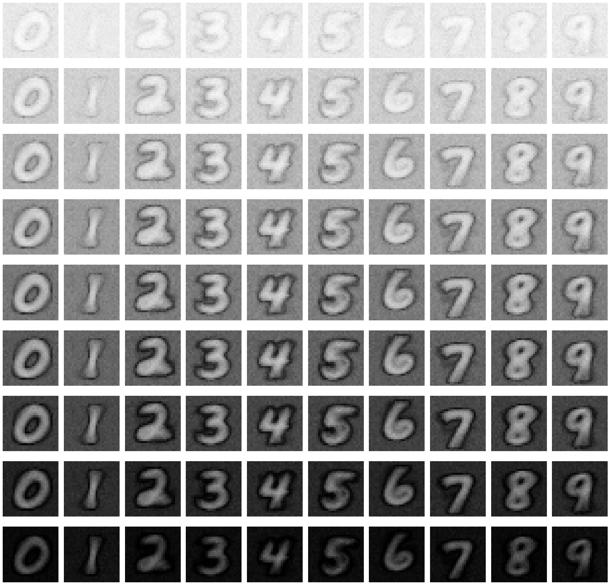
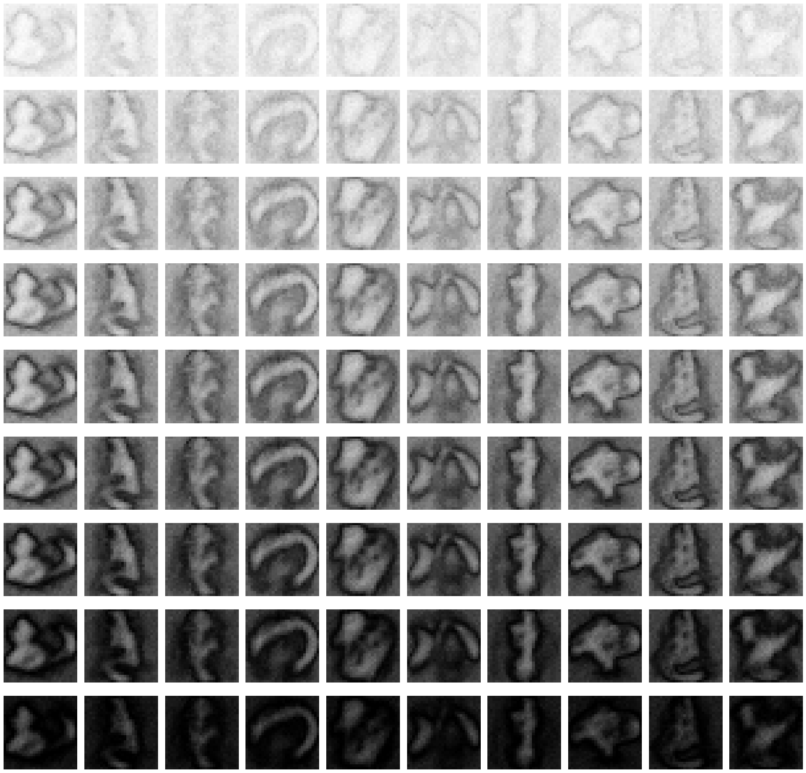

# CS-439 Optimization for Machine Learning - Class Project

<div align="center">
<p>
 &nbsp;&nbsp;&nbsp;&nbsp;  
</p>
<div>
<a href="https://colab.research.google.com/drive/14aRBOVrymdUs_XVt5ixkdqOBnwOQUGqs?usp=sharing"></a>
</div>
</div>


## Group Members

- Aoyu Gong (aoyu.gong@epfl.ch)
- Sijia Du (sijia.du@epfl.ch)
- Qiyuan Dong (qiyuan.dong@epfl.ch)


## Introduction

This project focuses on a network pruning algorithm proposed on ICLR 2019, namely [SNIP for single-shot network pruning](https://openreview.net/forum?id=B1VZqjAcYX). We reproduced the experiments of the original paper with a similar experimental setup. In particular, we evaluated the algorithm on two datasets with seven network architectures given by the reference. Our implementation is based on the [GitHub repo](https://github.com/namhoonlee/snip-public) provided by the authors of the original paper. To further study its robustness, we validated the effectiveness of the algorithm on an additional dataset and nine network architectures, provided numerical and visualization results with respect to a wide range of configurations, and compared our result with the original paper.


## Requirements

### Dependencies

You can reproduce our results by two ways, using either [Google Colab Pro](https://colab.research.google.com/signup) or your local system.

- Reproduce our results on Colab.
  - Colab contains most of needed packages, and is easy and highly recommended for reproducing our results.

  - Note that our codes requires `tensorflow-gpu 1.14.0`, which is not pre-installed in today's Colab. Be sure to run

    ```bash
    # Install required packages
    %tensorflow_version 2.x
    !pip install gast==0.2.2
    !pip uninstall -y tensorflow
    !pip install tensorflow-gpu==1.14.0
    ```
  
    at the beginning of the Colab notebook `run.ipynb` to setup the environment correctly.
  
- Reproduce our result on your local system.
  - To reproduce our results, you should install the following packages.
    - gast 0.2.2
    - matplotlib 3.3.4
    - numpy 1.19.2
    - imgaug 0.4.0
    - tensorflow-gpu 1.14.0
  - GPUs with at least 25.46 GB RAM are required. Otherwise, you will get `RuntimeError: CUDA out of memory`.

### Datasets

Download the following datasets and move the files to the corresponding folders.

- Download the [Kuzushiji-MNIST](https://github.com/rois-codh/kmnist) dataset and move the files into `./KMNIST`.
- Download the [MNIST](http://yann.lecun.com/exdb/mnist/) dataset and move the files into `./MNIST`.
- Download the [CIFAR-10](https://www.cs.toronto.edu/~kriz/cifar.html) dataset and move the files into `./cifar-10-batches-py`.


## How to Reproduce Our Experiments

You can reproduce our experiments in two ways, using either [Google Colab Pro](https://colab.research.google.com/signup) or your local machine.

- Reproduce our experiments on Colab.
  
  - First, create a folder called `Mini-Project` in your Google Drive, i.e., `/gdrive/MyDrive/Mini-Project`.
  
  - Second, make sure the structure of the folder is the same as the **Folder Structure** section.
    - `git clone` our repo to your local machine and then move the code to the folder.
    - Download the three datasets and then move the files to the folder.
  - Third, click `Change runtime type` under the menu `Runtime`, and select `GPU` as `Hardware accelerator` and `High-RAM` as `Runtime shape`.
  - Last, run the provided Jupyter notebook `run.ipynb` under the root directory with `Run all`.
  
- Reproduce our experiments on your local machine.
  - First, install all the dependencies mentioned in the **Requirement** section.
  - Second, create a folder called `Mini-Project` on your local machine, i.e., `./Mini-Project`.
  - Third, make sure the structure of the folder is the same as the **Folder Structure** section.
    - `git clone` our repo to your local machine and then move the code to the folder.
    - Download the three datasets and then move the files to the folder.
  - Last, run the provided Jupyter notebook `run.ipynb` under the root directory with `Run all`.


## Folder Structure

```
./Mini-Project
├── README.md
|
├── results.xlsx                    # All the results from our experiments
|
├── report.pdf                      # Our report
|
├── run.ipynb                       # The Jupyter notebook to run the algorithm and reproduce our results.
|
├── snip/                           # Folder contains all the sources files to run the algorithm
|   ├── train.py                    # Define the training process
|   ├── test.py                     # Define the test process
|   ├── prune.py                    # Define the pruning process which is executed before training
|   ├── network.py                  # Define multiple neural network architectures
|   ├── model.py                    # Define the entire model, including the network, loss, optimization, and input/output processing, etc.
|   ├── mnist.py                    # Process the MNIST dataset
|   ├── main.py                     # Main file that parses arguments and initializes the entire training and testing procedure
|   ├── kmnist.py                   # Process the KMNIST dataset
|   ├── helpers.py                  # Several auxiliary functions
|   ├── dataset.py                  # Process the dataset to feed the model
|   ├── cifar.py                    # Process the CIFAR-10 dataset
|   └── augment.py                  # Perform data augmentation
|
├── cifar-10-batches-py/            # Folder for the CIFAR-10 dataset
|   ├── batches.meta
|   ├── data_batch_1
|   ├── data_batch_2
|   ├── data_batch_3
|   ├── data_batch_4
|   ├── data_batch_5
|   ├── readme.html
|   └── test_batch
|
├── KMNIST/                         # Folder for the KMNIST dataset
|   ├── t10k-images-idx3-ubyte.gz
|   ├── t10k-labels-idx1-ubyte.gz
|   ├── train-images-idx3-ubyte.gz
|   └── train-labels-idx1-ubyte.gz
|
└── MNIST/                          # Folder for the MNIST dataset
    ├── t10k-images-idx3-ubyte.gz
    ├── t10k-labels-idx1-ubyte.gz
    ├── train-images-idx3-ubyte.gz
    └── train-labels-idx1-ubyte.gz
```


## Useful Links

The algorithm of SNIP is presented in [our report](./report.pdf) and [the original paper](https://openreview.net/forum?id=B1VZqjAcYX).

The following network architectures are used for evaluating.

- resnet-18, resnet-34: [Deep Residual Learning for Image Recognition](https://openaccess.thecvf.com/content_cvpr_2016/papers/He_Deep_Residual_Learning_CVPR_2016_paper.pdf)
- squeezenet-vanilla, squeezenet-bypass: [SqueezeNet: AlexNet-level accuracy with 50x fewer parameters and < 0.5 MB model size](https://arxiv.org/pdf/1602.07360.pdf)
- googlenet: [Going Deeper with Convolutions](https://www.cv-foundation.org/openaccess/content_cvpr_2015/papers/Szegedy_Going_Deeper_With_2015_CVPR_paper.pdf)
- densenet-121, densenet-169, densenet-201, densenet-264: [Densely Connected Convolutional Networks](https://openaccess.thecvf.com/content_cvpr_2017/papers/Huang_Densely_Connected_Convolutional_CVPR_2017_paper.pdf)
